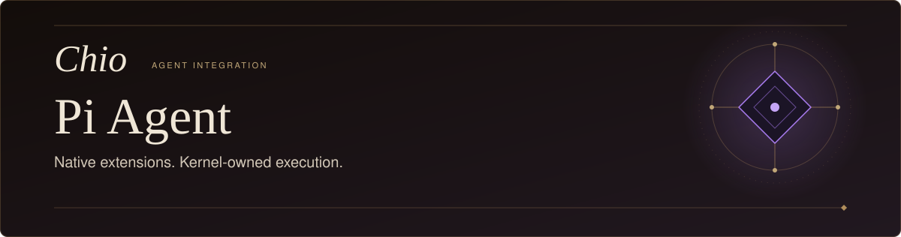
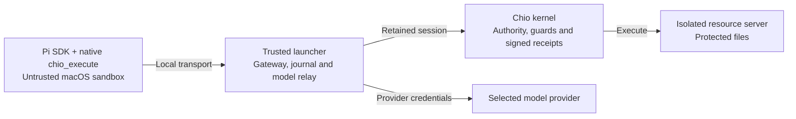

<p align="center">
  <picture>
    <source media="(max-width: 600px)" srcset="docs/assets/readme-hero-mobile.svg" />
    
  </picture>
</p>

<p align="center">
  <strong>Pi's reasoning. Chio's authority.</strong>
</p>

<p align="center">
  <a href="#what-it-does">Overview</a>&nbsp;&nbsp;&middot;&nbsp;&nbsp;
  <a href="#build-and-install">Install</a>&nbsp;&nbsp;&middot;&nbsp;&nbsp;
  <a href="#run-a-task">Run</a>&nbsp;&nbsp;&middot;&nbsp;&nbsp;
  <a href="#the-execution-boundary">Boundary</a>&nbsp;&nbsp;&middot;&nbsp;&nbsp;
  <a href="#resume-and-recover">Recovery</a>&nbsp;&nbsp;&middot;&nbsp;&nbsp;
  <a href="#development">Develop</a>
</p>

## What it does

Chio for Pi connects the stock [Pi coding agent](https://github.com/earendil-works/pi)
to [Chio](https://github.com/backbay-labs/chio) through a native extension. Pi can
read, write, edit and list files in an operator-selected resource workspace.
The kernel checks authority, executes each operation through its resource server,
and returns signed evidence for the adapter to verify.

- **Choose the resource access.** The operator supplies the tool inventory,
  capability, scope and trusted signer before the session starts.
- **Keep credentials with the operator.** The trusted launcher owns the kernel
  transport and model relay. Pi receives ephemeral local transport credentials.
- **Preserve outcomes across interruption.** The gateway retains original
  requests and verified results. An unknown external outcome blocks new work
  until the operator reconciles it.

**Availability:** this is an unpublished restricted candidate for macOS. The
public Pi peer is available on npm; build this plugin from source below. Bounded
real-host observations exist, while complete published-release acceptance remains
open. [Current qualification](docs/STATIC-KERNEL-QUALIFICATION.md) identifies the
exact tested combinations. A rebuilt archive has its own identity.

## Build and install

Use Node.js **22.19.0 or newer** and npm. Native runtime observations used Node
25.5.0 on macOS 26.4 arm64; the release build uses Node 22.19.0 with npm 11.8.0.
The protected launcher requires macOS `sandbox-exec`.

Start in a new working directory:

```sh
git clone https://github.com/backbay-labs/chio-pi-plugin.git
cd chio-pi-plugin
npm ci --ignore-scripts
npm run pack:release
```

The packer builds TypeScript and writes a tarball, SHA-256 file and provenance
record to `artifacts/`. Checked-in vendor archives supply the Chio bridge and SDK;
the resulting package bundles them. No private sibling checkout is required.

Install the exact public Pi peer first, then the local plugin archive:

```sh
(cd artifacts && shasum -a 256 -c chio-pi-plugin-0.1.0.tgz.sha256)
mkdir ../chio-pi-install
cd ../chio-pi-install
npm install --ignore-scripts --install-strategy=nested --save-exact \
  @earendil-works/pi-coding-agent@0.85.1
npm install --ignore-scripts --install-strategy=nested \
  ../chio-pi-plugin/artifacts/chio-pi-plugin-0.1.0.tgz
./node_modules/.bin/chio-pi --help
```

Registry access is required for Pi and the public TypeBox dependency. Keep the
peer-first, nested installation order: it avoids the documented transitive
resolution failure in Pi's published shrinkwrap. Help verifies the entrypoint;
it does not start protected execution. See [release qualification](docs/RELEASE-QUALIFICATION.md)
for clean installation checks, provenance and publication procedures.

## Run a task

First [provision a compatible Chio kernel and isolated resource server](https://github.com/backbay-labs/chio/blob/70071260afe514b06cac1c319487bd48e465d39e/integrations/required-agents/README.md),
then prepare a retained session with the bridge's `chio-prepare-gateway` command.
The original public CLI 0.1.0 does not supply the required contract. Use the
kernel and operator-tool identities in the [compatibility record](docs/FINAL-QUALIFICATION.md#supported-combination)
and its [static-kernel follow-up](docs/STATIC-KERNEL-QUALIFICATION.md).

The prepared configuration binds the actual caller, capability, kernel session,
server, trusted signer and explicit tool inventory. It must contain the delegated
`chio.mcp.session-credential.v1` metadata and a private gateway journal path.
An operator-wide bearer is refused. The current launcher requires a kernel
endpoint at `http://127.0.0.1:PORT`.

Keep the private configuration, authoritative journal, installation, empty Pi
profile and disposable local working directory separate. The kernel resource
server must not mount credentials, the Pi profile or installed code. In the
example, `/workspace` belongs to that resource server, not the local `--cwd`.

With `OPENAI_API_KEY` already set in the operator's environment:

```sh
./node_modules/.bin/chio-pi \
  --config /absolute/private/pi-gateway.json \
  --profile /absolute/private/pi-profile \
  --cwd /absolute/disposable/pi-workspace \
  --provider openai --model gpt-4.1-mini \
  --prompt 'Write /workspace/note.txt with the text "Hello from Pi", then read it back.'
```

Pi calls the native `chio_execute` tool with the configured tool name and
arguments. JSONL output contains Pi messages, tool results and a retained
`sessionFile`; verified successful results include kernel receipts. Keep that
output private when task content is sensitive.

For ChatGPT subscription mode, replace the provider/model line with
`--provider openai-codex --model gpt-5.5` and add
`--codex-auth /absolute/private/codex/profile/auth.json`. The operator supplies a
private native Codex login cache outside all guest paths. Native Codex owns login
and refresh; this launcher reads the cache without copying or refreshing it.
The account must have access to the selected model. Current native qualification
uses this subscription mode; API-key evidence belongs to earlier artifacts.
[Provider and operational details](docs/FINAL-QUALIFICATION.md#operation-and-limitations)
record that distinction.

## The execution boundary



The installed `chio-pi` launcher establishes the process boundary. Pi can write
its dedicated profile and contact only the launcher's local gateway and model
relay. Kernel credentials, provider credentials and the authoritative journal
stay in the trusted parent. Receipt and result verification precede delivery
acknowledgement; the parent confirms delivery through Pi's native tool history
before another model turn.

The supported mode exposes print/SDK execution and kernel-owned file workflows.
Native file and shell tools, third-party extension discovery, delegation,
background jobs, attachments, raw RPC and interactive commands are unavailable.
Tool calls are sequential. Loading the extension into an ordinary Pi session or
embedding the exported SDK helpers requires a separate process boundary. The
protected launcher refuses source-checkout execution and has no sandbox bypass
flag. The [action inventory](docs/ACTION-INVENTORY.md) describes each surface and
its resource owner.

## Resume and recover

Resume with the same configuration, profile, workspace and model options, adding
`--resume /absolute/private/pi-profile/sessions/SESSION.jsonl` for the retained
`sessionFile`. The path must be inside that profile's sessions directory. Changed
authority, signer, session or tool inventory refuses profile reuse.

The terminal `chio_session` record carries the outcome. Unresolved operations
exit 2, tool errors retained at task completion exit 3, and pending approval exits
4. Provider/runtime failures or incomplete generation exit 1; cancellation exits
130 or 143. A model's explanation does not clear uncertainty.

Inspect retained outcomes with `chio-gateway-operator status CONFIG` in a trusted
operator installation. Preserve the original request, configuration and journal;
never clear them or mint new authority to retry an uncertain effect. Dead-owner
lock recovery only releases a stale process lock. Exact-result reconciliation
uses the separately pinned operator utility described in the
[recovery procedure](docs/FINAL-QUALIFICATION.md#operation-and-limitations).
A configured approval flow resumes the original request and arguments after an
operator decision. Session expiry must not silently create replacement authority.

For upgrades, stop the runner, retain unresolved state and install the next
verified artifact into a new directory before checking compatibility. For
removal, resolve outstanding outcomes, close or revoke the retained authority,
and remove only the dedicated installation and profile. Keep required receipts
and private operator state. [Release operation](docs/RELEASE-QUALIFICATION.md#verify-and-recover)
and the [qualification record](docs/STATIC-KERNEL-QUALIFICATION.md) cover the
supported procedures and their limits.

## Development

From the source checkout, after `npm ci --ignore-scripts`:

```sh
npm run typecheck
npm test
npm run pack:release -- /absolute/new-candidate-directory
```

The package exports `chioExtension`, `createChioPiSession`, `bridgeExecutor`,
`readPreparedConfig` and `configuredExecutor` for adapter development. Their
[TypeScript entrypoint](src/index.ts) exposes the corresponding types. These
in-process APIs do not establish the launcher's OS boundary on their own.

Deterministic stock-Pi dispatcher and recovery tests run through `npm test`.
Real host/kernel observations, independent resource checks and preserved failures
live in the [evidence records](docs/FINAL-QUALIFICATION.md). Source checks and
packaging success remain separate from runtime acceptance.

[Apache-2.0](LICENSE) · [Chio](https://github.com/backbay-labs/chio) ·
[Pi upstream](https://github.com/earendil-works/pi) ·
[Chio bridge](https://github.com/backbay-labs/chio-bridge)
