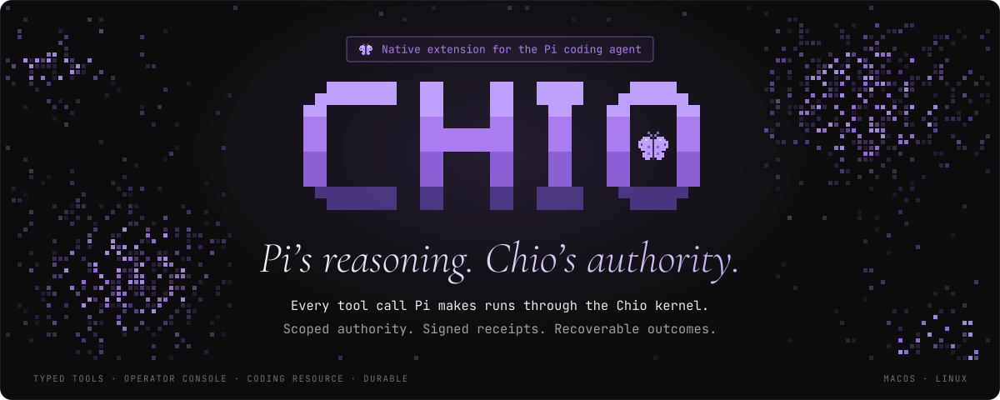
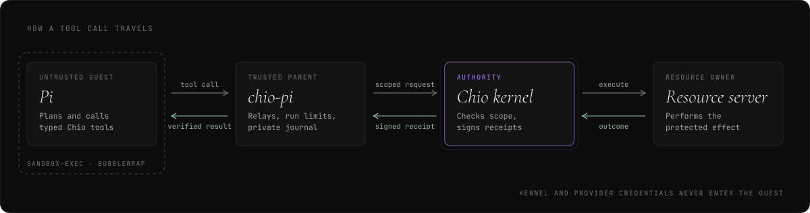

<p align="center">
  <picture>
    <source media="(max-width: 600px)" srcset="docs/assets/readme-hero-mobile.svg" />
    
  </picture>
</p>

<p align="center">
  <a href="#build-and-install">Install</a>&nbsp;&nbsp;&middot;&nbsp;&nbsp;
  <a href="#how-it-works">How it works</a>&nbsp;&nbsp;&middot;&nbsp;&nbsp;
  <a href="docs/GETTING-STARTED.md">Guide</a>&nbsp;&nbsp;&middot;&nbsp;&nbsp;
  <a href="#documentation">Docs</a>&nbsp;&nbsp;&middot;&nbsp;&nbsp;
  <a href="https://www.chio.computer">chio.computer</a>
</p>

---

Chio for Pi puts the [Pi coding agent](https://github.com/earendil-works/pi) on a
kernel. Pi plans and calls tools. [Chio](https://github.com/backbay-labs/chio)
decides what each call may do, performs it through an isolated resource server,
and returns a signed receipt. Pi never holds kernel or provider credentials.

- **Scoped authority.** The operator fixes the tools, capability and trusted
  signer before the session starts. Pi sees typed tools generated from that
  inventory, and nothing else.
- **Signed receipts.** Every result is bound to its request, caller and signer,
  and verified before Pi sees it.
- **Recoverable outcomes.** An uncertain effect is fenced, never retried blindly.
  Recovery returns the original result instead of minting a new operation.

## How it works

<p align="center">
  <picture>
    <source media="(max-width: 600px)" srcset="docs/assets/readme-boundary-mobile.svg" />
    
  </picture>
</p>

Pi runs confined, under `sandbox-exec` on macOS or bubblewrap on Linux. It can
reach two local endpoints, both owned by the trusted `chio-pi` launcher: its
gateway and its model relay. The launcher holds the credentials, enforces
run limits and keeps the private journal. The kernel checks each call against the
delegated authority and executes it through the resource server.

## Build and install

Requires Node.js 22.19 or newer and npm, on macOS or Linux. Install the plugin
and its exact Pi peer into a new directory:

```sh
mkdir ~/chio-pi && cd ~/chio-pi && npm init -y >/dev/null
npm install @chio-protocol/pi-plugin @earendil-works/pi-coding-agent@1.0.2
npx --no -- chio-pi --help
```

The [guide](docs/GETTING-STARTED.md#build-and-install) covers the optional Pi
Durable adapter and the Linux runtime manifest. To build the archive yourself,
see [build from source](docs/GETTING-STARTED.md#build-from-source).

## Run a task

Installing gives you the launcher, not a kernel. A task needs a Chio kernel with
an isolated resource server and a prepared gateway session; the
[guide](docs/GETTING-STARTED.md#run-a-task) walks through both. From the install
directory, with `OPENAI_API_KEY` set in the operator's environment:

```sh
./node_modules/.bin/chio-pi \
  --config /absolute/private/pi-gateway.json \
  --profile /absolute/private/pi-profile \
  --cwd /absolute/disposable/pi-workspace \
  --provider openai --model gpt-4.1-mini \
  --prompt 'Write /workspace/note.txt with the text "Hello from Pi", then read it back.'
```

Output is JSONL: Pi's messages, verified tool results with their kernel receipts,
and a session file to resume from. A ChatGPT subscription works too, with
`--provider openai-codex --model gpt-5.5 --codex-auth <path>`. Exit codes,
resuming and recovery are in the [guide](docs/GETTING-STARTED.md#resume-and-recover)
and the [operator console](docs/OPERATOR.md).

## What ships

| Entrypoint | What it is |
| --- | --- |
| `chio-pi` | The protected launcher, plus `doctor`, `status`, `inspect` and `recover` operator commands |
| `chio-coding-resource` | A kernel-owned coding resource: search, compare-and-swap patches, confined tests and artifact publication |
| `@chio-protocol/pi-plugin` | The SDK: extension, session, typed tool registry, continuation, governance and run limits |
| `@chio-protocol/pi-plugin/coding-resource` | The coding resource participant |
| `@chio-protocol/pi-plugin/durable` | The optional Pi Durable adapter |

The SDK entrypoints run in-process. Only the `chio-pi` launcher establishes the
operating-system boundary.

## Status

`0.2.0` is a candidate for Pi 1.0.2. Its npm package is `@chio-protocol/pi-plugin`;
the frozen `0.1.0` archive was named `@chio/pi-plugin` and was never published.

- **Qualified.** The frozen `0.1.0` archive with Pi 0.85.1 on macOS, recorded in
  [final qualification](docs/FINAL-QUALIFICATION.md).
- **Evidence for 0.2.0.** Component, stock-host, local confinement and
  cold-consumer checks. The [roadmap crosswalk](docs/ROADMAP-IMPLEMENTATION.md)
  maps every feature to its evidence.
- **Still open.** Kernel qualification of `0.2.0` itself, the native service
  profiles, x64 runtime and live provider acceptance.

> [!NOTE]
> **Breaking in 0.2.0.** `chioExtension(executor)` without a registry now throws.
> Pass `createToolRegistry(tools, "legacy")` for the old `chio_execute` surface.

## Documentation

| Guide | Covers |
| --- | --- |
| [Getting started](docs/GETTING-STARTED.md) | The full walkthrough: install, run, the boundary, resume and recovery |
| [Typed tools](docs/TYPED-TOOLS.md) | How the operator's inventory becomes native Pi tools |
| [Operator console](docs/OPERATOR.md) | `doctor`, `status`, `inspect` and `recover` |
| [Coding resource](docs/CODING-RESOURCE.md) | Search, patches, confined tests and publication |
| [Continuation](docs/CONTINUATION.md) | Original-operation recovery and the Pi Durable adapter |
| [Run limits and Linux](docs/RUN-LIMITS-LINUX.md) | Budgets, deadlines and whole-Pi bubblewrap confinement |
| [Native compatibility](docs/NATIVE-COMPATIBILITY.md) | Governance modes and native service gates |
| [Roadmap crosswalk](docs/ROADMAP-IMPLEMENTATION.md) | Each feature's entrypoints, evidence and open prerequisites |

Qualification records: [final qualification](docs/FINAL-QUALIFICATION.md),
[release qualification](docs/RELEASE-QUALIFICATION.md) and the
[action inventory](docs/ACTION-INVENTORY.md).

## Development

```sh
npm ci --ignore-scripts
npm run typecheck
npm test
npm run pack:release -- /absolute/new-candidate-directory
```

[Release qualification](docs/RELEASE-QUALIFICATION.md#candidate-020) covers the
cold-consumer checks for a new candidate, and [publishing](docs/PUBLISHING.md)
the npm release path.

---

<p align="center">
  <a href="LICENSE">Apache-2.0</a>&nbsp;&nbsp;&middot;&nbsp;&nbsp;
  <a href="https://www.chio.computer">chio.computer</a>&nbsp;&nbsp;&middot;&nbsp;&nbsp;
  <a href="https://github.com/backbay-labs/chio">Chio</a>&nbsp;&nbsp;&middot;&nbsp;&nbsp;
  <a href="https://github.com/earendil-works/pi">Pi</a>&nbsp;&nbsp;&middot;&nbsp;&nbsp;
  <a href="https://github.com/backbay-labs/chio-bridge">Chio bridge</a>
</p>
